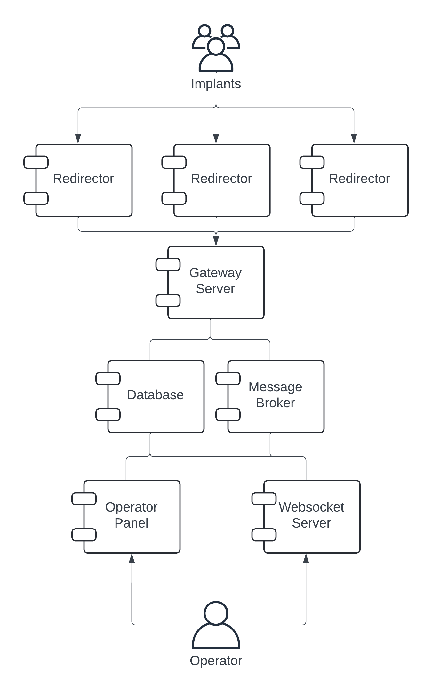

# Architecture

## Project Requirements

- Designed to work through multiple red team engagements.
- Easily manageable:
      - Simple user management
      - Simple project management
      - Role-Based Access Control
- Extendible.
- Reliable.
- Provide real-time updates to the operator.

## Overview

### Core

Considering the following requirements, an idea emerged that included the following components:

- Operator Panel - a dedicated fullstack application for operators. It is from here that operators interact with implants, admins manage accounts and projects.
- Websocket Server - a separate service designed around Event-Driven Development. Communication is completely asynchronous.
- Gateway Server - a separate service designed to handle communication from redirectors to core components. Communication is synchronous. Emits events that Websocket Server handles.
- Redirectors - separate services designed to directly communicate with implants. They validate and relay information to the Gateway Server.
- Database - for storing all the data.
- Message Broker - to enable Event-Driven Development.

### Additinal Services

Accounting for the design choices, several more components are required:

- Tracing Platform - to log, analyse and debug events across systems.
- Metrics Collector - solution to collect metrics from the services to enable thorough monitoring.
- Dashboard Solution - place to analyse and plot monitoring metrics.

### Graphical Representation

